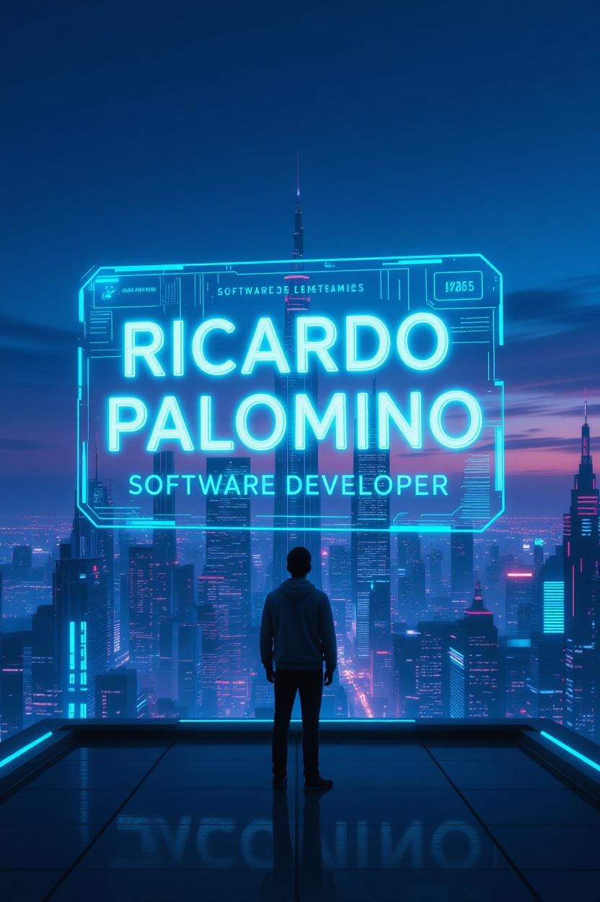

<!-- ===== BANNER PRINCIPAL ===== -->

  

<!-- ===== TÍTULO ===== -->
<h1 align="center" style="font-size: 3em; font-weight:900; background: linear-gradient(135deg,#00e0ff,#00aaff); -webkit-background-clip:text; -webkit-text-fill-color:transparent;">
  Ricardo Palomino
</h1>
<h3 align="center" style="color:#9bdcff; font-weight:600;">
  💻 Desarrollador de Software | 🚀 Full-Stack Engineer | 🎯 Problem Solver
</h3>

  <em>Construyo soluciones de software elegantes, escalables y con propósito.</em> 
  <strong>💡 Código limpio. Arquitectura sólida. Resultados reales.</strong>

---

### 🎯 Sobre Mí

Soy un desarrollador de software apasionado por construir aplicaciones que impactan.  
Combino pensamiento crítico, atención al detalle y ejecución ágil para entregar resultados **reales y medibles**.  

> 🧠 *“Menos código, más impacto. Software que evoluciona sin romperse.”*

---

### ⚡ Lo que me define

| 💡 Filosofía | 💻 Enfoque | 🚀 Mentalidad |
|---------------|------------|---------------|
| Código limpio y testeable | UX + performance equilibrados | Startup mindset: velocidad + calidad |
| Arquitectura modular y escalable | Full-Stack sin fronteras | Aprendizaje continuo |

---

### 🛠️ Stack Tecnológico

#### 🌐 Frontend  

#### ⚙️ Backend & DB  

#### ☁️ DevOps & Tools  

---

### 🚀 Proyectos Destacados

<table>
  <tr>
    <td width="50%" valign="top">
      <h4>🔐 API REST Escalable</h4>
      
<strong>Proyecto-A</strong> — API de alto rendimiento con autenticación JWT y CI/CD.

      
<code>Node.js</code> • <code>Express</code> • <code>PostgreSQL</code> • <code>Docker</code>

      <a href="https://github.com/tu-usuario/proyecto-a">🔗 Ver Repositorio</a>
    </td>
    <td width="50%" valign="top">
      <h4>⚡ Dashboard Moderno</h4>
      
<strong>Proyecto-B</strong> — SPA con SSR, optimización SEO y diseño responsivo.

      
<code>React</code> • <code>Next.js</code> • <code>TypeScript</code> • <code>Tailwind</code>

      <a href="https://github.com/Ricardo-Palomino">🔗 Ver Repositorio</a>
    </td>
  </tr>
  <tr>
    <td width="50%" valign="top">
      <h4>🔄 Pipeline ETL Automatizado</h4>
      
<strong>Proyecto-C</strong> — Procesamiento de datos asíncrono con monitoreo inteligente.

      
<code>Python</code> • <code>Celery</code> • <code>Redis</code> • <code>Airflow</code>

      <a href="https://github.com/tu-usuario/proyecto-c">🔗 Ver Repositorio</a>
    </td>
    <td width="50%" valign="top">
      <h4>📱 Aplicación Móvil</h4>
      
<strong>Proyecto-D</strong> — App multiplataforma con sincronización en tiempo real.

      
<code>React Native</code> • <code>Firebase</code> • <code>Expo</code>

      <a href="https://github.com/tu-usuario/proyecto-d">🔗 Ver Repositorio</a>
    </td>
  </tr>
</table>

---

### 📊 Estadísticas y Actividad

  <table>
    <tr>
      <td>
        
      </td>
      <td>
        
      </td>
    </tr>
  </table>
   
  

---

### 💡 Qué Puedo Hacer Por Ti

| Servicio | Descripción |
|-----------|--------------|
| 🏗️ Arquitectura de software | Diseño de sistemas escalables y modulares |
| 💻 Desarrollo Full-Stack | Frontend + Backend + Integraciones |
| ⚙️ DevOps & Automatización | CI/CD, contenedores, despliegue en la nube |
| 🔍 Code Review | Auditoría de calidad, refactoring y rendimiento |
| 🎯 Mentoría Técnica | Formación en buenas prácticas y patrones de diseño |

---

### 📫 Conectemos

  
  
  

---

<h3 align="center">⭐ Si te gusta mi trabajo, considera dejar una estrella en mis repositorios</h3>

  <em>Construyendo el futuro, un commit a la vez.</em>

